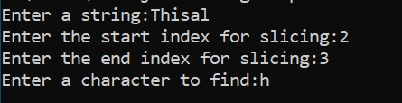
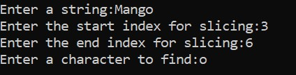
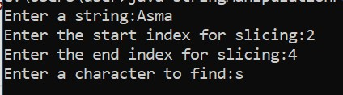
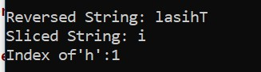
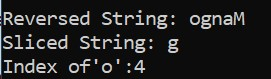
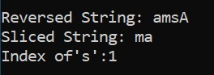

# Write a program that performs the following string manipulations:

### 1. Reverses a string.

### 2. Slices a string between specified indices (start and end).

### 3. Finds the index of a given character in the string.

## Use the following methods:

 -   `reverse(String value)` 
 
  Reverses the input string.

 - `slice(String value, int start, int end)` 

 Slices the input string from the given start index (inclusive) to the end index (exclusive).

- `indexOf(String value, char find)` 

 Finds the index of the specified character in the input string.

## The program should prompt the user for the following inputs:

#### 1. A string to manipulate.

#### 2. A start and end index for slicing.

#### 3. A character to search for in the string.

## Once the inputs are provided, the program should output:

#### 1. The reversed string.

#### 2. The sliced string.

#### 3. The index of the specified character.

## Sample Input:

## Sample Output:

