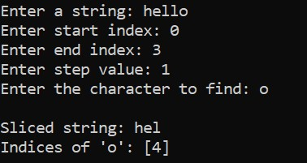
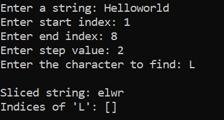
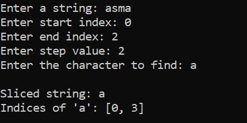
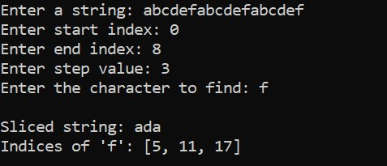

# String processing program

## problem statement

### Write a java program that performs two tasks:

- ####  Slice a String :  Extract a substring from a given string based on start index, end index (exclusive), and step value.

- ####  Find All Indices of a Character:  Identify all occurrences of a specified character in the string and return their indices.

## Method Signatures

## Slice Method

#### `public static String slice(String value, int start, int end, int step)`

- Returns a substring from start to end with increments of step.

- Uses loops without built-in substring functions.

## Find Indices Method

#### `public static ArrayList<Integer> getIndices(String value, char find)`

- Returns a list of all indices where find appears in value.

- Uses loops without additional string manipulation methods.

## Main Method Execution

#### 1. Prompts the user for a string input.

#### 2. Asks for start, end, and step values.

#### 3. Requests a character to find in the string.

#### 4. Calls both methods and displays results.

## Constraints

#### 1.  The step value will always be positive.

#### 2. Valid input indices are assumed (within bounds, start <= end).

#### 3. Only length() method is allowed for string operations.

## Notes

 - Implemented using loops only.

- Ensures efficient character lookup and slicing.

- Uses Scanner for user input.

## Expected output:

